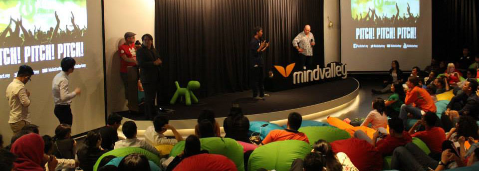

👋😁 Hi there, I'm Agung Sundoro aka [agung2001][website], a passionate full stack web developer and software engineer from Indonesia 🇮🇩.
I am an open-source enthusiast and maintainer. I love to collaborate and share with a member of open source community. 🌟🥳

 

## Things about me

- 📍 Lives in Jakarta, Indonesia.
- 📫 How to reach me: [Github Page][website].
- 🧩️ WordPress [Plugins](https://profiles.wordpress.org/agung2001/#content-plugins) and [Themes](https://profiles.wordpress.org/agung2001/#content-themes) contributor.

- 

    
🶠Top Spotify Artist I Love ğŸ¸ğŸ¥ğŸ¹

  - 🤘 [AC/DC](https://open.spotify.com/artist/4vGrte8FDu062Ntj0RsPiZ)
  - 🤘 [Dream Theater](https://open.spotify.com/artist/2aaLAng2L2aWD2FClzwiep)
  - 🤘 [Polyphia](https://open.spotify.com/artist/4vGrte8FDu062Ntj0RsPiZ)
  - 🤘 [Megadeth](https://open.spotify.com/artist/1Yox196W7bzVNZI7RBaPnf)
  - 🤘 [Steel Panther](https://open.spotify.com/artist/3l02WF362j1oHOurzuseBv)
  - [More](https://open.spotify.com/user/21yip2zhtynpaalfr53tonr5a)
  

- 

    
📚 List of books that changed my life 🔥🌟

  - 📙 [Atomic Habits](https://www.goodreads.com/book/show/40121378-atomic-habits)
  - 📙 [Good to Great](https://www.goodreads.com/book/show/76865.Good_to_Great)
  - 📙 [Superconnector](https://www.goodreads.com/book/show/35397470-superconnector)
  - 📙 [Steve Jobs](https://www.goodreads.com/book/show/11084145-steve-jobs)
  - 📙 [The 4-Hour Work Week](https://www.goodreads.com/book/show/9278897-the-4-hour-work-week)
  - 📙 [The Intelligent Investor](https://www.goodreads.com/book/show/106835.The_Intelligent_Investor)
  - 📙 [The Total Money Makeover](https://www.goodreads.com/book/show/78427.The_Total_Money_Makeover)
  - [More][goodreads]
  

- 

    
🤖 Things I code with

    |          | Details                                                                                                                                                                                                                                                                                                                                                                                                                                                                                                                                                                                                                                                                                                                    |
    |----------|----------------------------------------------------------------------------------------------------------------------------------------------------------------------------------------------------------------------------------------------------------------------------------------------------------------------------------------------------------------------------------------------------------------------------------------------------------------------------------------------------------------------------------------------------------------------------------------------------------------------------------------------------------------------------------------------------------------------------|
    | Languages |  |
    | Frontend |  |
    | Framework |  |
    | Database |  |
    | Tools    |  |
    | Build    |  |
    

- 

    
📊 Github Stats

    
    
    

## Support Me
- ☕️ [Buymeacoffee](https://www.buymeacoffee.com/agung2001) 
- 👍 [Paypal](https://www.paypal.com/paypalme/agungsundoro?utm_source=github)

[website]: https://agung2001.github.io
[wordpress]: https://profiles.wordpress.org/agung2001
[goodreads]: https://goodreads.com/agungsundoro